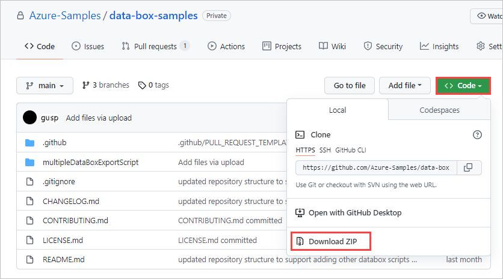

# Generate XML files for blob exports to multiple Data Box or Data Box Heavy devices

The `generateXMLFilesForExport.ps1` generates XML files for exporting from Azure Blob storage containers to multiple Azure Data Box or Azure Data Box Heavy devices. You then [create an export order using the XML files](/azure/databox/data-box-deploy-export-ordered?tabs=sample-xml-file#export-order-using-xml-file).

## Prerequisites

Before you begin, make sure you have:

- Windows client
- PowerShell 5.1 or later
- Az PowerShell 6.4.0 or later
- `generateXMLFilesForExport.ps1` script, stored in a convenient location

### Install Azure PowerShell

1. Install PowerShell v5.1 or later. For guidance, see [Install Windows PowerShell](https://docs.microsoft.com/powershell/scripting/install/installing-powershell?view=powershell-7.1).

2. [Install Az PowerShell 6.4.0](https://docs.microsoft.com/powershell/azure/install-az-ps?view=azps-6.4.0&preserve-view=true).
  
### Download the script

1. Go to the [repo in Azure Samples where Data Box sample files are stored](https://github.com/Azure-Samples/data-box-samples).

2. Download or clone the zip file for the repo.

   

   Extract the files from the zip, and save the script to a convenient location. Note where you saved it.

   You can also clone the samples:

   ```json
   git clone https://github.com/Azure-Samples/data-box-samples.git
   ```

## Run the script and create export orders

1. Run PowerShell as Administrator.
2. Set your execution policy to **Unrestricted**. This is needed because the script is an unsigned script.

   ```azurepowershell
   Set-ExecutionPolicy Unrestricted
   ```

3. Change directories to the directory where you stored the script. For example:

   ```azurepowershell
   cd \scripts\data-box-samples\multipleDataBoxExportScript\
   ```

4. Run the script. For example:

   ```azurepowershell
   .\generateXMLFilesForExport.ps1 -SubscriptionName exampleSubscription -ResourceGroupName exampleRG -StorageAccountName exampleStorageAccount -ContainerNames container1,container2 -Device DataBox
   ```

5. With an **Unrestricted** execution policy, you'll see the following text. Type `R` to run the script.

   ```azurepowershell
   Security warning
   Run only scripts that you trust. While scripts from the internet can be useful, this script can potentially harm your computer.
   If you trust this script, use the Unblock-File cmdlet to allow the script to run without this warning message. Do you want to
   run C:\scripts\data-box.ps1?
   [D] Do not run  [R] Run once  [S] Suspend  [?] Help (default is "D"): R
   ```

   When the script completes, all of the export XML files will be in the folder `\exportxmlfiles`. The folder's contents are overwritten on each run of the script.

6. Make the export orders. Follow the instructions in [Export order using XML file](https://docs.microsoft.com/azure/databox/data-box-deploy-export-ordered?tabs=sample-xml-file#export-order-using-xml-file) to create an export order for each XML file.


## Syntax

```powershell
.\generateXMLFilesForExport.ps1
        [-SubscriptionName] <String>
        [-ResourceGroupName] <String>
        [-StorageAccountName] <String>
        [-Device] <String>
        [-ContainerNames] <String[]> (Optional)
        [-StorageAccountKey] <String> (Optional)
```

## Parameters

| Parameter    | Description |
|--------------|-------------|
|`SubscriptionName <String>`|The Azure subscription for your storage account.|
|`ResourceGroupName <String>`|The resource group for your storage account.|
|`StorageAccountName <String>`|Name of your storage account.|
`Device <String>`|Indicates whether you're exporting to Data Box (`"DataBox"`) devices or Data Box Heavy (`"DataBoxHeavy"`) devices. <br>Do not use the `Device` parameter with `DataSize`.|
`ContainerNames <String[]>` (Optional)|Selects containers to export. This parameter can contain:<ul><li>a single container</li><li>a list of containers separated by commas</li><li>wildcard characters to select containers matching a pattern. </li></ul>If you don't include this parameter, all containers in the storage account are processed.|
|`StorageAccountKey <String>` (Optional) |The access key for the storage account. By default, PowerShell uses the user's credentials to authenticate the storage account. Use the access key if you don't otherwise have access to the storage account. [Find out the account access key](https://docs.microsoft.com/en-us/azure/storage/common/storage-account-keys-manage?tabs=azure-portal).|
|`DataSize <Long>` (Optional)|Indicates the size of the device you're exporting to.<br>Do not use the `DataSize` parameter with `Device`.|

## Usage notes

### Exporting a container with churning data

To minimize risk, avoid running this script on containers with churning data. If that is not possible, here is some important information about this script's behavior on churning data.

- If there are no deletions, all blobs present in the storage account when the script is run are included in the export XML files.
- Blobs added to the storage account after the script is run may or may not be included in the export XML files.
- Deletions after the script is run may result in script failures or export order failures.

### Script performance

This script's performance is bottlenecked by the number of blobs you want to export. If you are exporting containers with >100 million blobs, consider running this script on an Azure virtual machine located in the same datacenter as the containers.

- When run on an Azure virtual machine, this script processes 1 million blobs in ~2.5 mins.
- When run on a local machine, this script can take >5 mins per 1 million blobs depending on network speed.
 
[Overview of Azure Virtual Machines](https://docs.microsoft.com/azure/virtual-machines/windows/overview)

### Resuming the script
In the event where this script fails due to a network interruption or some other issue, you can resume the job from a checkpoint. If you rerun a script that previously failed you will be prompted with `"Would you like to load from checkpoint for previous job ran at <datetime of previous run>? (Y)/N"`. If `"Y"`, the job will resume. If `"N"` the job will start over.

## Sample output

### Export 365TB to multiple DataBoxes

This example splits `container1` into multiple DataBox export XML files. 

Sample command:

```azurepowershell
.\generateXMLFilesForExport.ps1 -SubscriptionName "ExampleSubscription" -ResourceGroupName ExportTestRG -StorageAccountName 50milblobsworth365tb -ContainerNames container1 -Device DataBox
```

Sample output:

```output
Transcript started, output file is C:\Users\azureuser\data-box-samples\multipleDataBoxExportScript/log.txt

authenticating storage account..
storage account authenticated

[11/01/21 15:01:27] Processing containers: 'container1', storage account: '50milblobsworth365tb', resource group: 'ExportTestRG'

[11/01/21 15:01:27] processing container: 'container1'...
[11/01/21 15:41:07] C:\Users\azureuser\data-box-samples\multipleDataBoxExportScript/exportxmlfiles/export_50milblobsworth365tb_2021-11-01_150126541.xml is ready for an export order!
[11/01/21 15:41:07]
[11/01/21 15:54:04] C:\Users\azureuser\data-box-samples\multipleDataBoxExportScript/exportxmlfiles/export_50milblobsworth365tb_2021-11-01_154107217.xml is ready for an export order!
[11/01/21 15:54:04]
[11/01/21 16:24:15] C:\Users\azureuser\data-box-samples\multipleDataBoxExportScript/exportxmlfiles/export_50milblobsworth365tb_2021-11-01_155404487.xml is ready for an export order!
[11/01/21 16:24:15]
[11/01/21 17:25:01] C:\Users\azureuser\data-box-samples\multipleDataBoxExportScript/exportxmlfiles/export_50milblobsworth365tb_2021-11-01_162415471.xml is ready for an export order!
[11/01/21 17:25:01]
[11/01/21 17:50:01] blobs processed: 50002560
[11/01/21 17:50:01] processing complete, export xml files generated successfully in exportxmlfiles/
Transcript stopped, output file is C:\Users\azureuser\data-box-samples\multipleDataBoxExportScript\log.txt
```